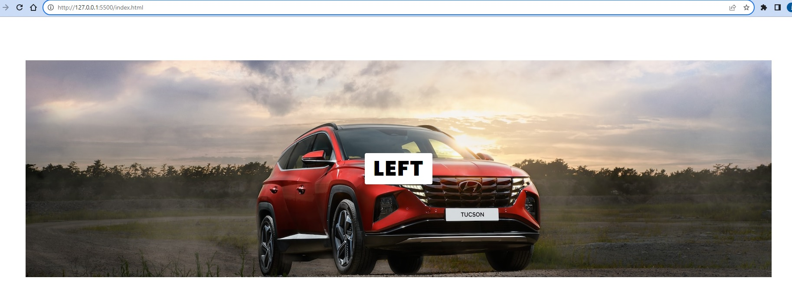

# Center

POsition absolute / relative

# Usage

```
.divImage {
    position: relative;
    width: 100%;
    height : 500px;
    overflow: hidden;
    display: flex;
    justify-content: center;
    align-items: center;
}

.divImage h2{
    position: absolute;
    font-size: 3em;
    text-transform: uppercase;
    letter-spacing: 2px;
    font-weight: 800;
    background: #fff;
    padding: 0 20px;
    border-radius: 4px;
}
```

# Screenshot

